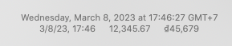
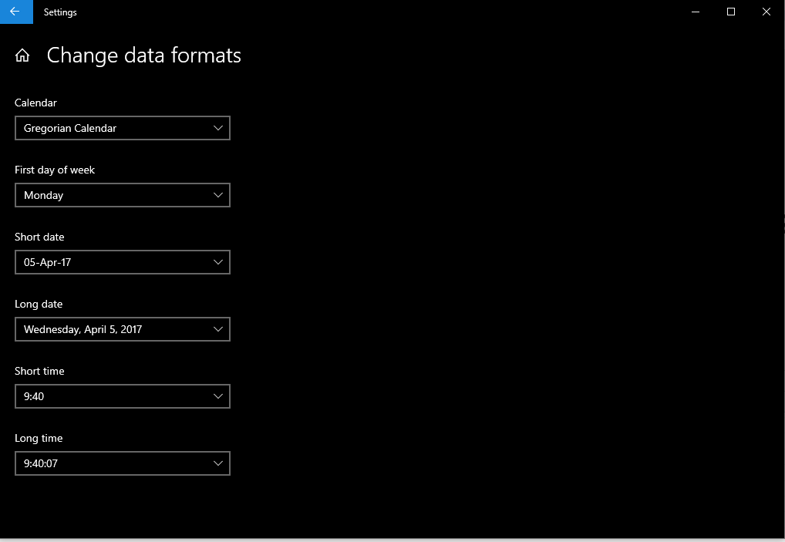
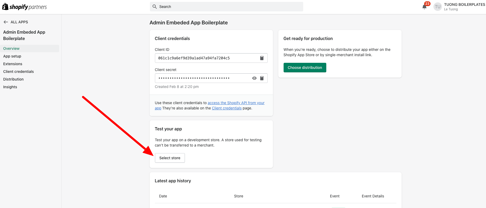

# Các lỗi thường gặp

## Lỗi "failed to parser session ... 'nbf' claim timestamp check failed" 
- MacOS: Format hợp lệ

- Windows: Format hợp lệ 

## Lỗi webhook process failed
- Lưu ý khi đổi endpoint cho webhook vì shopify không tự động update theo -> Cần viết tool để update webhook bằng REST API và GraphQL

## Lỗi shopify không redirect đến trang cài app
- Tiến hành login vào partner và cài app bằng tay
- Tại giao diện quản lý app chọn "Select store" 