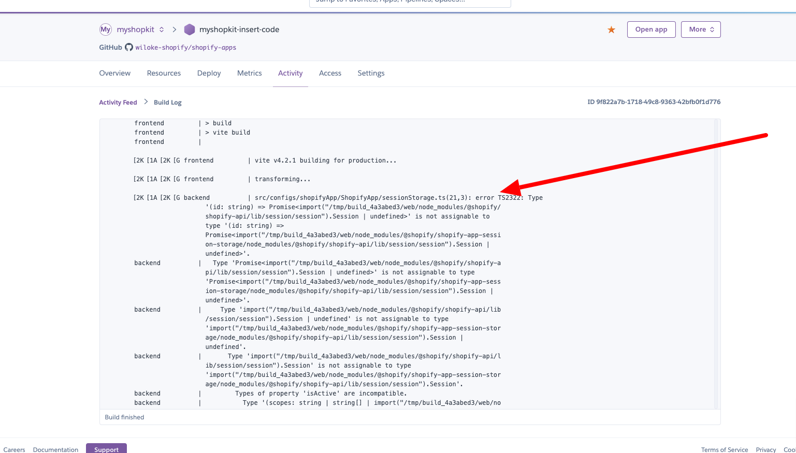

# Các lỗi thường gặp

## Lỗi "failed to parser session ... 'nbf' claim timestamp check failed" 
- MacOS: Format hợp lệ

- Windows: Format hợp lệ 

## Lỗi webhook process failed
- Lưu ý khi đổi endpoint cho webhook vì shopify không tự động update theo -> Cần viết tool để update webhook bằng REST API và GraphQL

## Lỗi shopify không redirect đến trang cài app
- Tiến hành login vào partner và cài app bằng tay
- Tại giao diện quản lý app chọn "Select store" 

## Lỗi typescript khi build
- Hình ảnh minh hoạ 
- Lỗi do sự xuất hiện của "./web/node_modules/@shopify/@shopify/shopify-app-express/node_modules/@shopify/shopify-api" dẫn đến việc xuất hiện 2 thư viện "@shopify/shopify-api". Mà 2 bản này có version khác nhau ==> Điều này làm cho typescript bị conflict => Build lỗi
- Cách kiểm tra:
  - MacOS: Chạy terminal "find . -type d -name shopify-api"
  - Windows: "dir /s /b shopify-api"
- Cách fix: Bump up "@shopify/shopify-app-express"
- Một lỗi tương tự [Shopify/shopify-app-template-node#1208](https://github.com/Shopify/shopify-app-template-node/issues/1208)