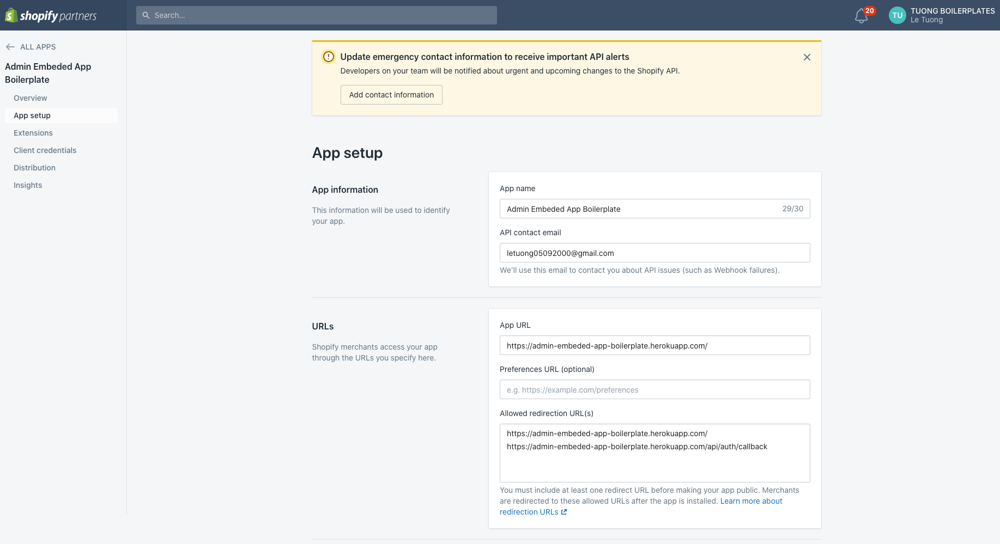

## Yêu cầu
1. Phương pháp để quản lý "env variables" vì github không thể reveal value như heroku 

## Pros
- Không phải di chuyển các app trong "extensions" ra ngoài root -> Dễ dàng quản lý

## Cons
- Github actions sẽ tự động chạy khi push code lên nhánh được lắng nghe
- Build lâu hơn
- Quản lý "env variables" khó khăn vì github không thể reveal value như heroku

## Các bước deploy heroku

1. Setup shopify app in partner
  1.1 Tại dashboard team chọn "Create New App" 
  1.2 Các phần còn lại (App Logic, Rule, ...) sẽ được người khác setup

2. Setup heroku
  2.1 Tại dashboard team chọn "Create New App" 

3. Setup github actions
  3.1. Lấy các thông tin heroku cần dùng để điền vào "Actions secrets and variables"
    - Lấy HEROKU_EMAIL & HEROKU_API_KEY từ trang [Account settings](https://dashboard.heroku.com/account) 
    - Lấy HEROKU_APP_NAME từ trang [Dashboard](https://dashboard.heroku.com/) 
  3.2. Setup "Actions secrets and variables" 

## Example
1. Kết quả của "Setup shopify app in partner"
  - Kết quả bước 1.1 
  - Kết quả bước 1.2 

2. Kết quả của "Setup github actions"
  - "Actions secrets and variables" 
  - "Actions run successfully" 

#### Deploy thành công
- Server log 