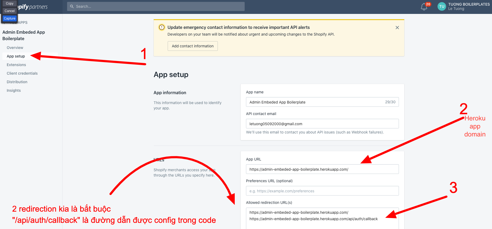
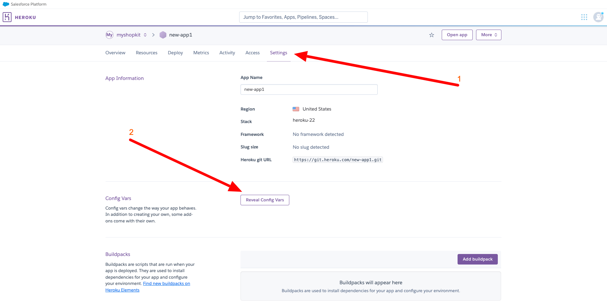
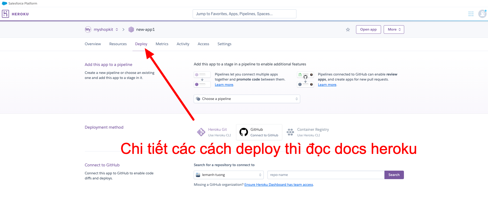
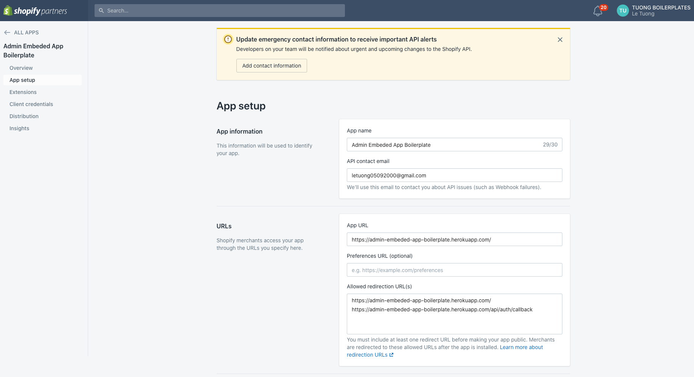
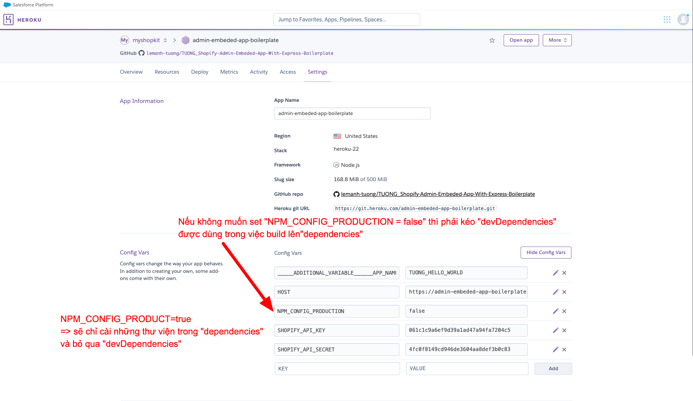
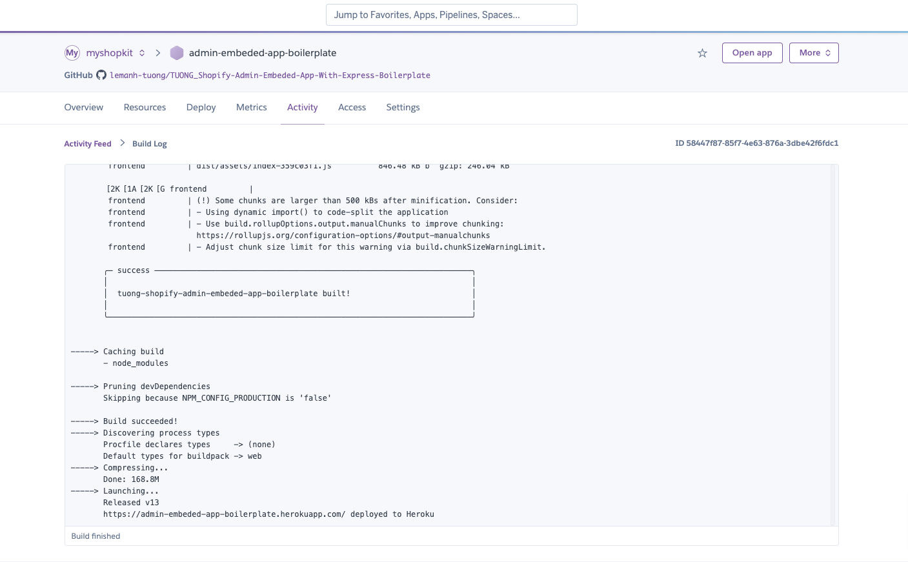
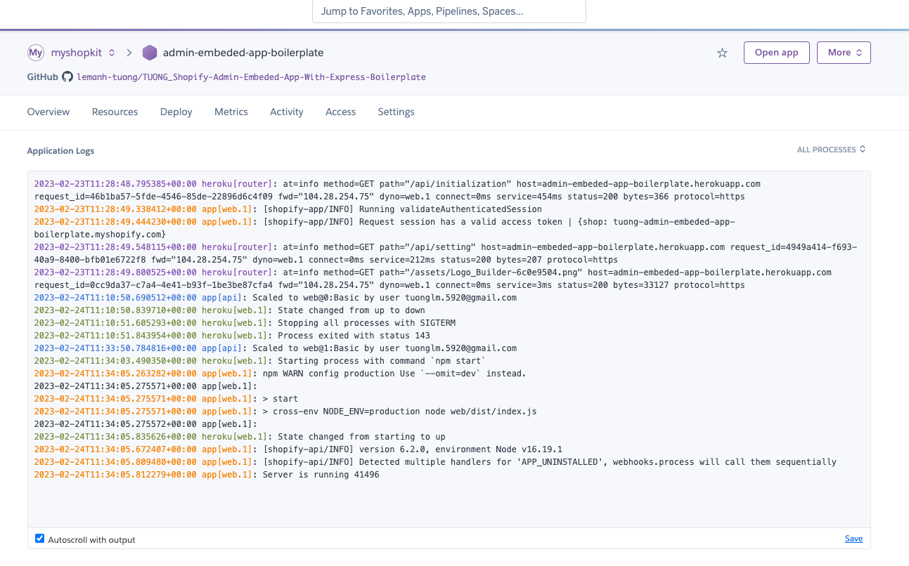

## Yêu cầu:
  1. Các theme app extension, ... (những thứ liên quan đến theme, file liquid, ...) cần move ra ngoài folder "extensions" - tốt nhất là di chuyển ra ngoài "root". 
<b><i><u>Tại sao lại phải như vậy -> Khi chạy build, @shopify-cli sẽ chạy theme app check. Cái này cần setup "Ruby" và heroku multiple buildpacks tại thời điểm file này được viết là không tìm được cách giải quyết</u></i></b>

  2. Gemfile cần được xoá để heroku không auto detect sang "Ruby buildpack" 

## Pros
  - Dễ dùng
  - Config nhanh, build nhanh, debug nhanh
  - Có thể build tự động hoặc manual
  - Quản lý "env variables" dễ dàng 
  
## Cons
  - Việc quản lý vào thao tác với các app trong "extensions" trở nên khó khăn khi lúc build cần move ra ngoài và lúc cần chạy @shopify-cli để push lên shopify thì lại phải kéo vào và chạy lệnh

## Các bước deploy heroku bằng giao diện dashboard của heroku 

0. Xoá file ".github/workflows/deploy-heroku.yml"

1. Setup shopify app in partner
  1.1 Tại dashboard team chọn "Create New App" 
  1.2 Các phần còn lại (App Logic, Rule, ...) sẽ được người khác setup

2. Setup app heroku
  2.1 Tại dashboard team chọn "Create New App" 
  2.2 Setup biến môi trường cần thiết  
  2.3 Deploy 
  2.4 Theo dõi kết quả build
  2.5 Xem log xem server đã được start hay gặp lỗi

## Example
1. Kết quả của "Setup shopify app in partner"
  - Kết quả bước 1.1 
  - Kết quả bước 1.2 

2. Kết quả của "Setup app heroku"
  - Env setup 
  - Build log 

#### Deploy thành công
- Server log 