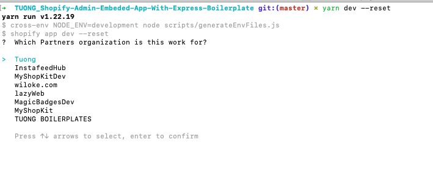
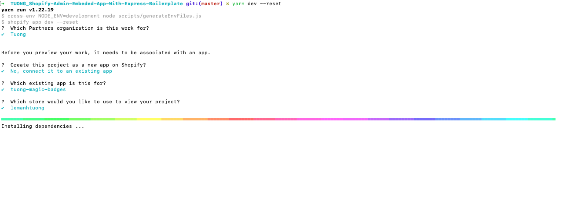

# Requirements
  - You've installed [Nodejs](https://nodejs.org/en/download/) 14.17.0 or higher.
  - You've installed a Node.js package manager: either [npm](https://docs.npmjs.com/getting-started), [Yarn 1.x](https://classic.yarnpkg.com/lang/en/docs/install/#mac-stable).
  - You've installed [Git 2.28.0](https://git-scm.com/) or higher.
  - You've installed [Ruby](https://www.ruby-lang.org/en/documentation/installation/) 2.7.5 or higher.
  - You're using the latest version of [Chrome](https://www.google.com/chrome/) or [Firefox](https://www.mozilla.org/vi/).

# Relate documentations
  - [Shopify CLI](https://shopify.dev/docs/apps/tools/cli)
  - [Theme app extension](https://shopify.dev/docs/apps/online-store/theme-app-extensions/)
  - [Admin embeded app](https://shopify.dev/docs/apps/getting-started/create)

# Structure Convention
### Root
  - Là nơi chứa những configs chung của cả project 
    - env file
    - eslint
    - husky, lint-staged, commitlint
    - .vscode
    - ...

### "Web" folder
  - Folder "src" là nơi chứa code BE
  - Root direction chứa các config cho BE
    - typescript config
    - nodemon config
    - ...

### "Web/frontend" folder
  - Folder "src" là nơi chứa code FE
  - Root direction chứa các config cho FE
    - vite config
    - typescript config
    - ...

### File "index.ts" chỉ xuất hiện tại:
  1. những folder được "module hoá" - tức có folder ".docs" để tránh lỗi "Cannot access before initialization"
  2. Những folder có "index.ts" thì file "index.ts" phải được hiển thị ở một vị trí riêng biệt để dễ nhìn => Đặt tên file in hoa nếu có thể, nếu không phải đặt folder riêng và tiếp tục có file "index.ts"

# Get started
- Xem xét update các tag "START_EDIT:" được comment
- Các tag "DANGER:" và "WARNING:" cần phải xem xét trước khi thay đổi
- Chạy 2 scripts "husky:commitlint" và "husky:lint-staged" để khởi tạo husky trước khi tạo commit và push lên github
- Điền các biến env vào file ".env" và ".env.example" tại root project
- Chạy dev
1. Chạy "yarn dev" 
2. Đăng nhập vào shopify bằng tài khoản được cung cấp hoặc tự tạo 
3. Đợi thông báo đăng nhập thành công từ shopify 
4. Chọn partner được mời vào 
5. Tạo app mới hoặc kết nối tới một app đã tồn tại 
  5.1 Kết nối tới một app đã tồn tại 
  5.2 Tạo app mới 
6. Chọn shop được "Người chịu trách nhiệm cuối cùng" tạo trước đó hoặc một shop bất kì 
7. Đợi cài đặt dependencies thành công 
8. Tốt nhất nên chọn option 1 
9. Theo các gợi ý ở terminal, ấn "P" để mở trình duyệt 