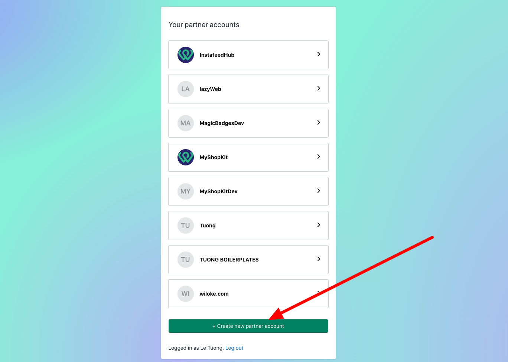
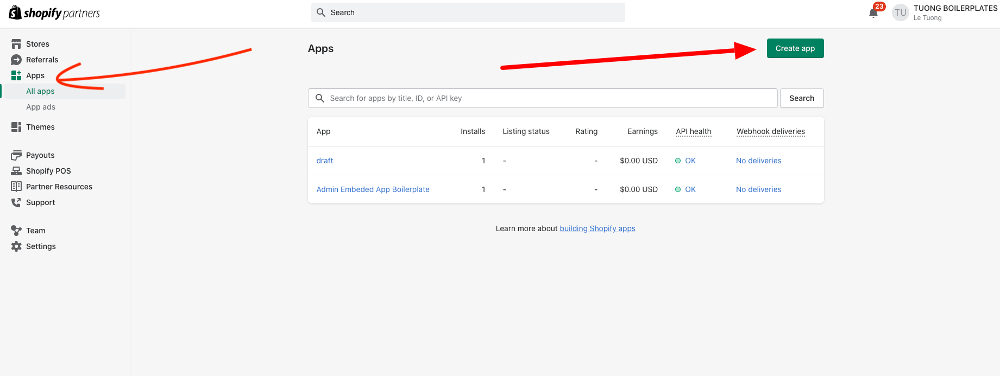
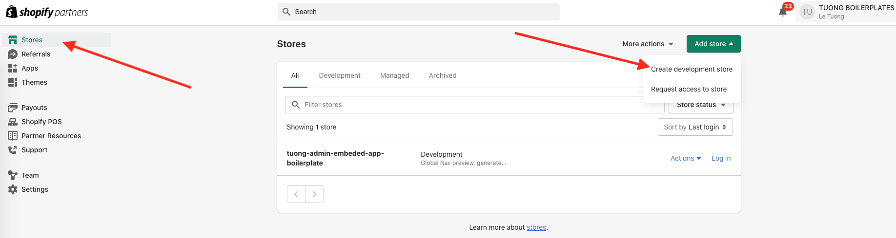

# Setup shopify

## Setup shopify partner
1. Đăng nhập shopify partner tại https://partners.shopify.com/organizations
2. Tại giao diện "Organizations" chọn "Create new partner account" 
3. Làm theo các bước và hoàn thành

## Setup shopify app 
1. Tại giao diện "Shopify Partner" chọn "Create app" 
2. Tại giao diện chọn "Create app manually" 
3. Làm theo các bước và hoàn thành

## Setup dev store 
1. Tại giao diện "Shopify Partner" chọn "Add store" 
2. Làm theo các bước và hoàn thành - Lưu ý 