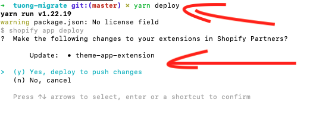
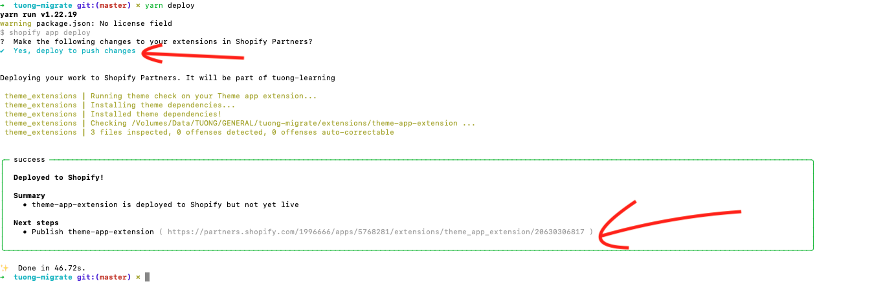
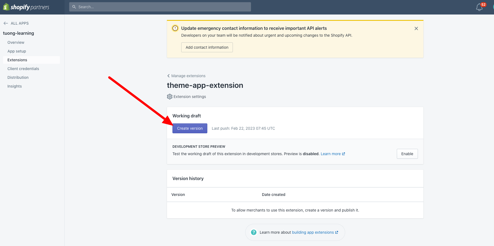
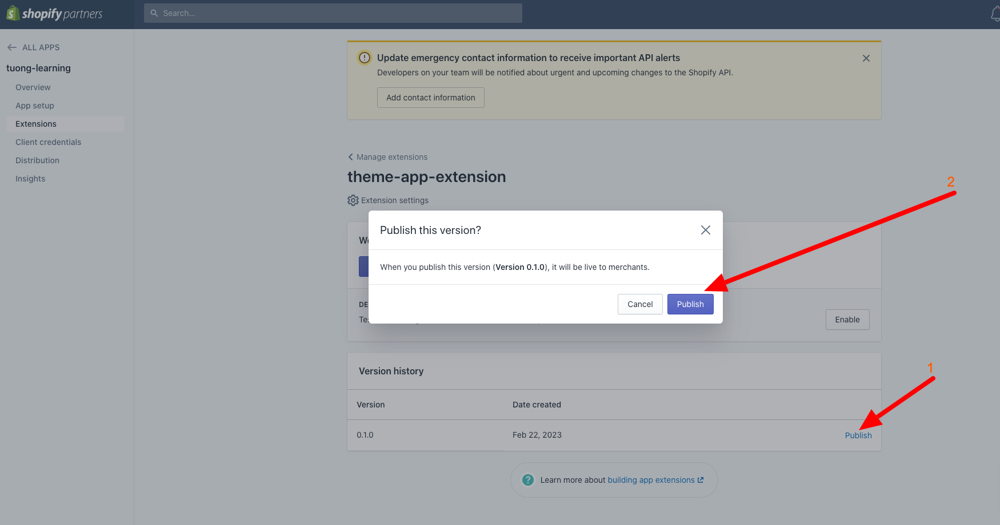

# Get started

## Relate documentations
- [Getting started with theme app extensions](https://shopify.dev/docs/apps/online-store/theme-app-extensions)
- [Theme architecture](https://shopify.dev/docs/themes/architecture)
- [Liquid](https://shopify.dev/docs/api/liquid)

## Deploy & update version

- Lưu ý mỗi khi muốn js, liquid, css thay đổi ta cần thực hiện update version theme app extension. Khi đó js, css, liquid hiển thị trên shop khách mới được update

### Các bước deploy & update version
1. Chỉnh sửa code
2. Chạy "yarn deploy" và chọn các options 
3. Truy cập link được trả về 
4. Tại trang partner vừa truy cập thực hiện "Create new version" 
5. Thực hiện "Publish" version vừa tạo 
6. Đợi shopify vài phút và test code mới 
  - Ví dụ với app "Magic Badges"
    - Cấu trúc folder:
      - assets/magic-badges.js
      - blocks/app-embed.liquid
    - HTML được in vào shop:
      - Javascript: https://cdn.shopify.com/extensions/e0d55c9b-a6c5-4230-a8ec-612324f7f578/1.33.0/assets/magic-badges.js
        - "https://cdn.shopify.com/extensions/" => Do shopify fix cứng
        - "e0d55c9b-a6c5-4230-a8ec-612324f7f578" => random id do shopify sinh ra
        - "1.33.0" => Version hiện tại của theme app extension
        - "assets/magic-badges.js" => File js của theme app extension
      - Css: Tương tự
      - HTML: ```<div is="magic-badges"></div>...```